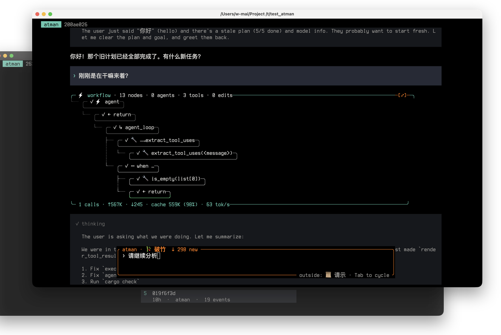

<p align="center">
  <a href="https://atman.run">
    
  </a>
</p>

<h1 align="center">atman · <span style="font-size:0.6em;opacity:0.6">आत्मन्</span></h1>

<p align="center">
  atman witnesses; code exists
</p>

<p align="center">
  <a href="https://github.com/W-Mai/atman/actions"></a>
  <a href="LICENSE-MIT"></a>
  <a href="LICENSE-APACHE"></a>
  
</p>

<p align="center">
  <a href="#quickstart">Quickstart</a> ·
  <a href="docs/quickstart.md">Docs</a> ·
  <a href="examples/">Examples</a> ·
  <a href="#why-atman">Why atman?</a>
</p>

[](https://atman.run)

---

<a id="quickstart"></a>

### Installation

```bash
git clone https://github.com/W-Mai/atman.git
cd atman
cargo install --path crates/atman-cli

atman init          # scaffold ~/.config/atman/
atman doctor        # verify config + providers
atman               # launch the TUI
```

Set an API key via env var (`ANTHROPIC_API_KEY` / `OPENAI_API_KEY`) or inline in `~/.config/atman/config.toml`:

```toml
[models."deepseek/deepseek-v4-pro"]
provider = "anthropic"
api_key = "sk-..."
context_budget = 1000000

[alias.smart]
model = "deepseek/deepseek-v4-pro"
```

> [!TIP]
> atman can run tools that edit files and execute commands. Start in a disposable repo until you understand the configured tools. Use `contract.scope` in your flow to statically limit what each flow can touch.

---

`atman` turns coding-agent workflows into reproducible flows written in the `.at` language — atman's own DSL for wiring LLM calls, tools, approvals, and sub-agents. Instead of a single chat where the model decides what to do next, you write a `.at` flow that decides what happens next; the LLM executes what it's assigned. Every run emits a typed event trace you can replay, audit, and monitor.

```
flow agent(user_prompt: string) -> string {
    contract {
        capabilities { shell: true }
    }
    _prompt_lands_via_begin_turn = user_prompt
    return subflow(agent_loop, 0)
}

flow agent_loop(iteration: int) -> string {
    when iteration >= 200 {
        return "[agent: 200-iteration ceiling — task likely stuck, ask the user before continuing]"
    }
    reply = llm {
        model: "smart"
        context: session
        system: "Planning tools: use plan.write/read/tick for the active high-level route through a multi-step task. A plan is a durable ordered checklist that atman injects back into every LLM call; create or revise one for work that spans several steps, files, tool calls, or turns, then call plan.tick when a plan step is truly complete. Use memory.todo.set/done/cancel/delete/list for concrete execution items inside the current plan step: small trackable units with where/why/how/expected_result, especially when you need a visible work queue or may pause and resume. Do not mirror the same item in both systems. If a plan step is enough, do not create a todo. If a todo becomes the whole strategy, replace it with a plan. Typical flow: set or read the plan, execute one plan step, create todos only for that step's sub-work, finish/cancel those todos, then tick the plan step."
        cache: true
        retry: 12
        tools: [
            fs.read, fs.write, fs.edit, fs.list, fs.grep,
            bash.spawn, bash.status, bash.output, bash.kill, bash.list,
            term.spawn, term.input, term.capture, term.resize, term.kill, term.list,
            web.fetch, web.search,
            hunk.review, hunk.apply, hunk.plan_edit,
            git.diff, git.show, git.log, git.status, git.add, git.commit, git.branch, git.push, test.run,
            memory.confess, memory.fetch_confessions,
            memory.todo.set, memory.todo.done, memory.todo.cancel, memory.todo.delete, memory.todo.list,
            memory.goal.get, memory.goal.set, memory.goal.clear,
            memory.recent_turns, memory.history.search, memory.history.read,
            memory.spec.status, memory.spec.update, memory.spec.deviate,
            plan.write, plan.read, plan.tick,
            agent.spawn,
            form.ask,
            preview.push,
            session.push, sleep
        ]
    }
    tool_uses = extract_tool_uses(reply)
    when is_empty(tool_uses) {
        return text_concat(reply)
    }
    tool_results = dispatch_all(tool_uses)
    session.push(tool_results)
    j = iteration + 1
    return subflow(agent_loop, j)
}
```

Run it:

```bash
atman run examples/agent.at --flow agent user_prompt="read Cargo.toml and list the workspace members"
```

## What is atman?

> **आत्मन् (ātman)** — Sanskrit for *self*, the inner essence that witnesses thought but is not thought itself. The agent that watches the LLM's words and acts on them.

atman is a code interpreter for the `.at` language. It parses `.at` files, manages their runtime, and emits a typed event trace for every execution. The `.at` language is Turing-complete — it has variables, conditionals, recursion, fan-out, and subflows — so you can express any agent workflow as a deterministic program, not a prompt.

The LLM is just one node type inside that program. `llm { ... }` is a stochastic node; everything around it (the tool dispatch, the approval gates, the retry loops, the subflow recursion, the context compaction) is deterministic orchestration written in an unambiguous, concrete, and inspectable language. You orchestrate the agent's entire workflow in `.at`; the LLM only executes what the flow assigns to it — the *witness* that observes, never the driver.

## Why atman?

| | Mainstream code agents | atman |
|---|---|---|
| Orchestration | LLM-driven (model decides tool use) | Flow-driven (code decides, LLM executes) |
| Reproducibility | Non-deterministic | Deterministic `.at` flow orchestration, replayable event trace |
| Multi-model | One model per session | Cascade / ensemble / bridge across models in one flow |
| Tool safety | Prompt-level | 5-tier capability sandbox, statically checked at flow load |
| Workflow definition | Natural language prompts | Typed DSL with schema validation + flow versioning |
| Session trace | Chat log | Typed `events.jsonl` (replayable, FTS5-searchable) |
| Sub-agents | Hard-coded agent types | Arbitrary `subflow` with full scope isolation |
| Headless | Limited | JSON-RPC daemon + SSE events + bearer auth |

## Flow DSL

A `.at` file declares types, providers, tools, routes, lifecycle hooks, and flows. Flows are block-based and parsed by `syn`.

### A test-fix loop

From [`examples/edit_and_verify.at`](examples/edit_and_verify.at):

```
flow edit_and_verify(file: path, instruction: string) -> EditResult {
    contract {
        scope {
            read: [project_root]
            write: [project_root]
        }
        capabilities {
            shell: true
        }
    }

    original = fs.read(file)
    ok = user_confirm("Attempt edit-and-verify loop on " + shell_quote(instruction) + "?")
    when ok == false {
        return { status: "cancelled" }
    }

    result = fix_until_test_passes {
        edit_flow: llm {
            model: "smart"
            messages: [
                system_msg(@"prompts/edit.md"),
                user_msg("iter=" + to_json_string(iter) + "\nprevious failure:\n" + prev_fail + "\n\ninstruction: " + instruction),
            ]
            input: { file: file, original: original, instruction: instruction }
            schema: { new_content: string, rationale: string }
        }
        test: test.run(framework: "cargo", timeout_ms: 300000)
        target: file
        max_iters: 5
        on_giveup: { status: "gave_up", iters: iters, last_fail: prev_fail }
    }

    audit = preview.push(
        topic: "edit-and-verify",
        title: "edit-and-verify: " + file,
        content: "**iters:** " + to_json_string(result.iters) + "\n\n**status:** " + result.status,
    )

    return result
}
```

Run it:

```bash
atman run examples/edit_and_verify.at --flow edit_and_verify \
  file="src/main.rs" instruction="add a --version flag"
```

### Node types

| Node | Purpose |
|---|---|
| `llm { ... }` | Call an LLM with model, messages, tools, schema, retry, fallback |
| `fs.read(path)` / `fs.edit(...)` / `bash.spawn(cmd)` | Tool dispatch |
| `subflow(name, args)` | Spawn a child flow with isolated scope |
| `user_confirm(msg)` | Pause for human approval |
| `user_ask(prompt, schema)` | Structured user input |
| `fanout [a, b, c] collect: all` | Concurrent fan-out |
| `retry { ... } max: N` / `fallback { a } else { b }` | Composers |

### Routing + lifecycle

```
route "^review\\b"  -> flow review_code
route "^fix\\b(.*)" -> flow fix_issue
default_route       -> flow agent

on session.start { system_msg("boot") }
on turn.end       { memory.confess("checked in") }
```

See [`examples/`](examples/) for 9 canonical flows: agent loop, code review with fanout, hunk review, edit-and-verify, parallel exploration, and more.

## Tools

55+ built-in tools across 15 categories. Plus any MCP server (filesystem, browser, lark-cli, siyuan-note, playwright, …) configured in `mcp.toml` is auto-connected at boot and exposed through the same tool interface.

| Category | Tools | Tier |
|---|---|---|
| `fs` | read (0), list (0), grep (1), write (2), edit (2) | 0–2 |
| `bash` | spawn, status, output, kill, list | 4 |
| `term` | spawn, input, capture, resize, kill, list | 4 |
| `web` | fetch, search | 3 |
| `git` | diff, show, log, status (0), add, commit, branch (2), push (3) | 0–3 |
| `test` | run | 2 |
| `hunk` | review (0), apply (1), plan_edit (2) | 0–2 |
| `memory` | todo.list, goal.clear, recent_turns, history, fetch_confessions, spec.status (0), todo.set/done/cancel/delete, goal.get/set, confess, spec.update/deviate (1) | 0–1 |
| `plan` | read (0), write, tick (1) | 0–1 |
| `agent` | spawn | 2 |
| `form` | ask | 0 |
| `preview` | push | 1 |
| `session` | push | 0 |
| `sleep` | — | 0 |

### Capability tiers

Every tool declares a tier. Flow `contract.scope` statically validates all tool references at load time — a flow that tries to `bash.spawn` without `capabilities.shell: true` is rejected before it runs.

| Tier | Scope | Rollback |
|---|---|---|
| 0 | Pure read | Abort-safe |
| 1 | Project write | Pre-image (undo) |
| 2 | Git local | Reflog |
| 3 | Remote / irreversible | Requires confirm |
| 4 | Shell escape | Requires `capabilities.shell: true` + confirm |

## Context management

Long sessions don't die when the context fills up. `atman` runs proactive auto-compaction before an LLM call would overflow, generates a structured handoff summary, and holds a `compact_lock` so parallel workflow branches never race the compactor. Compaction is a first-class event in the transcript — you see it start, spin, and finish.

Three memory layers:

| Layer | Scope | Lifetime |
|---|---|---|
| **Todo** (`memory.todo.*`) | Current plan step | Session |
| **Plan** (`plan.*`) | High-level route across turns | Injected into every LLM call |
| **Confession** (`memory.confess`) | Project rule violations | Permanent, append-only |

## CLI

```text
atman                              # REPL (TUI)
atman run <file.at> [--flow <name>] [--mock] [--ephemeral]
atman logs tail [session] [--follow]
atman session list | show | search | sanitize
atman cost [session] [--all]
atman monitor [--port 65098]       # web UI
atman daemon start | stop | status | run
atman flow snapshot | versions | diff | rollback | lint | test
atman sync init | push | pull      # git-based cross-machine memory sync
atman migrate list | import [--from opencode|kiro]
atman doctor [--fix]
```

REPL builtins: `:help`, `:cost`, `:goal`, `:suggest`, `:compact`, `:copy`, `:attach`, …

## Configuration

`~/.config/atman/config.toml`:

```toml
[models."deepseek/deepseek-v4-pro"]
provider = "anthropic"
api_key = "..."
base_url = "https://..."
context_budget = 1000000
max_tokens = 393216
thinking = true

[alias.smart]
model = "deepseek/deepseek-v4-pro"

[alias.cheap]
model = "gpt-4o-mini"

[compaction]
review = "manual-only"   # always | manual-only | never

[sandbox]
enabled = true
strict = false

[theme]
mode = "auto"             # auto | dark | light | wuxia
```

Provider env vars: `ANTHROPIC_API_KEY` / `ANTHROPIC_BASE_URL` / `OPENAI_API_KEY` / `OPENAI_BASE_URL`.

## Architecture

```
atman/
  crates/
    atman-dsl/       # Parser + AST + pretty-printer (.at files)
    atman-runtime/   # Executor, tools, providers, memory, MCP, hunk, compaction
    atman-cli/       # Binary, REPL, slash commands, monitor, daemon client
    atman-proto/     # JSON-RPC 2.0 envelope + daemon request/response types
    atman-daemon/    # Daemon binary, Unix socket, HTTP+SSE, session pool
    atman-tui/       # Terminal UI — themes, workflow panel, diff preview, input
  examples/          # 9 canonical .at flow examples
  docs/              # Quickstart, context strategy, list combinators
```

Language: Rust (edition 2024, MSRV 1.85). License: MIT OR Apache-2.0.

## FAQ

**Is atman an IDE?**
No. atman is a runtime + CLI for coding-agent workflows. It runs in your terminal, as a daemon behind an HTTP API, or embedded.

**Is atman tied to one model provider?**
No. Anthropic, OpenAI, and any OpenAI-compatible endpoint (Ollama, DeepSeek, GLM, …) work through provider adapters. Mix models in a single flow.

**Can atman edit my files?**
Yes, when configured with file-editing tools. Use `contract.scope` to statically limit which paths each flow can read/write. Hunk review lets you approve edits before they land.

**How is atman different from Aider / Claude Code / Cline?**
Those are LLM-driven chat-first agents. atman is orchestration-driven: you write the flow, the flow decides what happens next, the LLM executes what it's assigned. This makes runs reproducible, auditable, and scriptable.

**What is MCP?**
Model Context Protocol. atman is an MCP consumer — any MCP server you configure in `mcp.toml` is auto-connected at boot and its tools appear alongside the built-in ones.

## Contributing

PRs welcome. Run `cargo fmt --all && cargo clippy --workspace --all-targets -- -D warnings && cargo test --workspace` before submitting.

## License

Dual-licensed under [MIT](LICENSE-MIT) or [Apache-2.0](LICENSE-APACHE), at your option.
